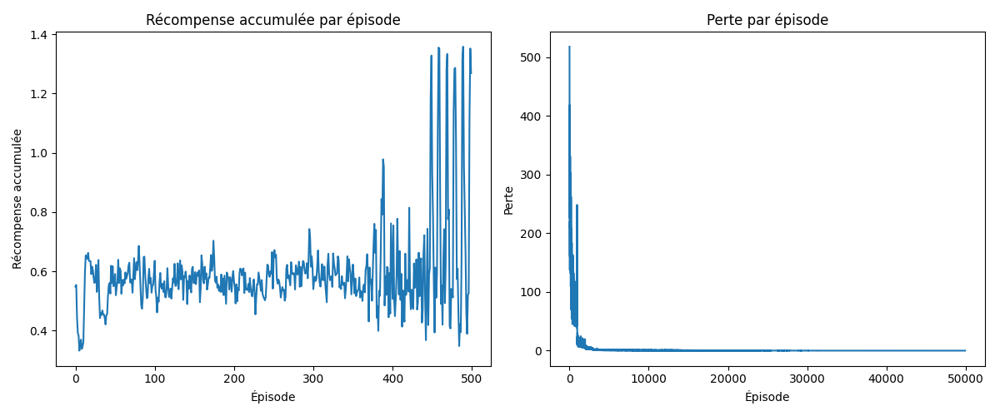

# Autonomous Decision System for Optimizing Vehicle Routes in Tecnomatix Plant Simulation

## Project Description

This project involves developing an autonomous decision system to optimize the routes of vehicles in a Tecnomatix Plant Simulation model. The system leverages reinforcement learning algorithms, including Q-Learning, Sarsa, and Deep Q-Network (DQN), to train agents that can make optimal decisions based on the state of the simulation. The primary objective is to automate the simulation in Tecnomatix, enabling efficient and effective route optimization for vehicles within the simulation environment.

## Project Functionality

The project is designed to automate and control Tecnomatix Plant Simulation, which exists in a Windows environment, from a Linux environment using Docker. An intermediate server facilitates communication between the two environments, allowing for seamless integration and automation. The project includes training AI models using reinforcement learning algorithms and then applying these models to optimize vehicle routes in the simulation.

### Key Features:
- **Reinforcement Learning Algorithms**: Implementation of Q-Learning, Sarsa, and Deep Q-Network (DQN) algorithms.
- **Model Training and Application**: Training AI models using (DQN) and applying the trained models to optimize routes.
- **Intermediate Server**: Utilization of an XML-RPC server to facilitate communication between the Linux and Windows environments.
- **Automation and Control**: Automated control of Tecnomatix Plant Simulation from a Docker container running in a Linux environment.

## Tools and Technologies Used

- **Python**
- **PyTorch**
- **Tecnomatix Plant Simulation**
- **XML-RPC**
- **Docker**
- **ROS Melodic**
- **OS Windows**

## Commands to Run the Project

Start the XML-RPC Server in Wondows:
  - python3 simulation_server.py
Start  ROS Core in Docker:
  - roscore
Run the Plant Simulation Node in Docker:
  - python3 plant_simulation_node.py
Run the Plant Simulation Node with Pretrained Model:
  - python3 plant_simulation_node2.py

## Methods of optimization

### Method 1: Q-Learning

Method 1 implements the Q-Learning algorithm to optimize vehicle routes in the Tecnomatix Plant Simulation. The Q-Learning algorithm updates the Q-values based on the rewards received from the environment, allowing the agent to learn the optimal policy over time.

### Method 2: Sarsa

Method 2 implements the Sarsa algorithm, which is an on-policy reinforcement learning algorithm. Sarsa updates the Q-values based on the action taken and the subsequent action chosen by the policy, allowing the agent to learn the optimal policy while following the current policy.

### Method 3: AI Model training

Method 3 is based on training a Deep Q-Network (DQN) model to optimize vehicle routes in the Tecnomatix Plant Simulation. The model is trained using reinforcement learning algorithms, and the trained model is then applied to make optimal decisions in the simulation. Below is an image illustrating the reward and loss after training the model: 

## Demo Video

For a detailed demonstration of the project's methods of optimization, please refer to the demo video:
[Lien vers la vidéo de démonstration](./DemoVideo.mp4)

## Conclusion

This project demonstrates the application of reinforcement learning algorithms to automate and optimize vehicle routes in Tecnomatix Plant Simulation. By leveraging an intermediate server and Docker, the project achieves seamless integration between Linux and Windows environments, enabling efficient simulation management and control.# ROS_Tecnomatix_AI_Projecet
# ROS_Tecnomatix_AI_Projecet
